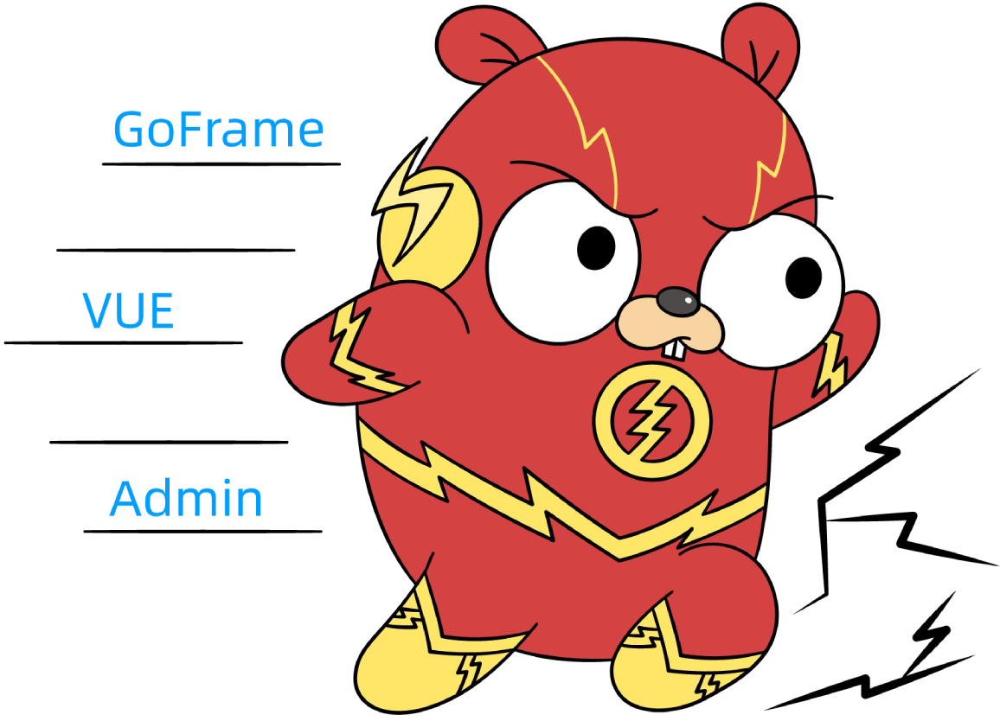

# 公告
各位gf-vue-admin的使用者， 本项目今年会完成升级架构，也会跟着goframe的版本节奏，由面向对象的写法切换到面向接口的写法
各位敬请期待！

<div align=center>

</div>
<div align=center>


</div>

这是简体中文文档

[English](https://github.com/flipped-aurora/gf-vue-admin/blob/master/README.md)

# 项目文档

[在线文档](https://sliverhorn.github.io/gf-vue-admin-doc)

- 前端UI框架：[element-ui](https://github.com/ElemeFE/element) 
- 后台框架：[GoFrame](https://goframe.org/index)

## 1. 基本介绍

### 1.1 项目介绍

在线预览 ==> 服务器过期,暂不开放在线预览

> Gf-vue-admin是一个基于vue和GoFrame开发的全栈前后端分离的后台管理系统，集成jwt鉴权，动态路由，动态菜单，casbin鉴权，表单生成器，代码生成器等功能，提供多种示例文件，让您把更多时间专注在业务开发上。

### 1.2 贡献指南

Hi! 首先感谢你使用 gf-vue-admin。

GoFrame-vue-admin 是一套为后台管理平台准备的一整套前后端分离架构式的开源框架，旨在快速搭建后台管理系统。

GoFrame-vue-admin 的成长离不开大家的支持，如果你愿意为 GoFrame-vue-admin 贡献代码或提供建议，请阅读以下内容。

#### 1.2.1 Issue 规范

- issue 仅用于提交 Bug 或 Feature 以及设计相关的内容，其它内容可能会被直接关闭。如果你在使用时产生了疑问，请到 Slack 或 [](https://gitter.im/Gf-Vue-Admin/community?utm_source=badge&utm_medium=badge&utm_campaign=pr-badge)
  里咨询。

- 在提交 issue 之前，请搜索相关内容是否已被提出。

#### 1.2.2 Pull Request 规范
- 请先 fork 一份到自己的项目下，不要直接在仓库下建分支。

- commit 信息要以`[文件名]: 描述信息` 的形式填写，例如 `README.md: fix xxx bug`。

- <font color=red>确保 PR 是提交到 `develop` 分支，而不是 `master` 分支。</font>

- 如果是修复 bug，请在 PR 中给出描述信息。

- 合并代码需要两名维护人员参与：一人进行 review 后 approve，另一人再次 review，通过后即可合并。

### 1.3 版本列表

- master: 1.0, 功能目前测试ing

## 2. 使用说明

```
- node版本 > v8.6.0
- golang版本 >= v1.11
- IDE推荐：Goland
- 各位在clone项目以后，把db文件导入自己创建的库后，最好前往七牛云申请自己的空间地址。
- 替换掉项目中的七牛云公钥，私钥，仓名和默认url地址，以免发生测试文件数据错乱
```

### 2.1 web端

```bash
# clone the project
git clone https://github.com/flipped-aurora/gf-vue-admin.git

# enter the project directory
cd web

# install dependency
npm install

# develop
npm run serve
```

### 2.2 server端

```bash
# 使用 go.mod

# 安装go依赖包
go list (go mod tidy)

# 编译
go build
```

### 2.3 swagger自动化API文档

- 去掉swagger的原因
	- 注释多余代码,导致代码臃肿
	- 推荐替代工具apipost


## 3. 技术选型

- 前端：用基于`vue`的`Element-UI`构建基础页面。
- 后端：用`GoFrame`快速搭建基础restful风格API，`GF(Go Frame)`是一款模块化、高性能、生产级的Go基础开发框架。实现了比较完善的基础设施建设以及开发工具链，提供了常用的基础开发模块，如：缓存、日志、队列、数组、集合、容器、定时器、命令行、内存锁、对象池、配置管理、资源管理、数据校验、数据编码、定时任务、数据库ORM、TCP/UDP组件、进程管理/通信等等。并提供了Web服务开发的系列核心组件，如：Router、Cookie、Session、Middleware、服务注册、模板引擎等等，支持热重启、热更新、域名绑定、TLS/HTTPS、Rewrite等特性。
- 数据库：采用`MySql`(8.0.19)版本，使用`gdb`实现对数据库的基本操作。
- 缓存：使用`Redis`实现记录当前活跃用户的`jwt`令牌并实现多点登录限制。
- 配置文件：使用`gcfg`配置管理。
- 日志：使用`glog`实现日志记录。


## 4. 项目架构
### 4.1 系统架构图


### 4.2 前端详细设计图 （提供者:<a href="https://github.com/baobeisuper">baobeisuper</a>）


### 4.3 目录结构

[前端请看此目录](https://sliverhorn.github.io/gf-vue-admin-doc/Manual/directory/#server)

[后端请看此目录](https://sliverhorn.github.io/gf-vue-admin-doc/Manual/directory/#server)

## 5. 主要功能

- 权限管理：基于[gf-jwt](https://github.com/gogf/gf-jwt) 和 [casbin](https://github.com/casbin/casbin)实现的权限管理 
- 文件上传下载：实现基于七牛云的文件上传操作（为了方便大家测试，我公开了自己的七牛测试号的各种重要token，恳请大家不要乱传东西）
- 分页封装：前端使用mixins封装分页，分页方法调用mixins即可 
- 用户管理：系统管理员分配用户角色和角色权限。
- 角色管理：创建权限控制的主要对象，可以给角色分配不同api权限和菜单权限。
- 菜单管理：实现用户动态菜单配置，实现不同角色不同菜单。
- api管理：不同用户可调用的api接口的权限不同。
- 富文本编辑器：MarkDown编辑器功能嵌入。
- 条件搜索：增加条件搜索示例。
- restful示例：可以参考用户管理模块中的示例API。 
```
前端文件参考: src\view\superAdmin\api\api.vue 
后台文件参考: model\dnModel\api.go 
```
- 多点登录限制：需要在`config.toml`中把`system`中的`UseMultipoint`修改为true
- 分片长传：提供文件分片上传和大文件分片上传功能示例。
- 表单生成器：表单生成器借助 [@form-generator](https://github.com/JakHuang/form-generator)。
- 代码生成器：后台基础逻辑以及简单curd的代码生成器。 

## 6. 计划任务

- [ ] 导入，导出Excel
- [ ] Echart图表支持
- [ ] 工作流，任务交接功能开发
- [ ] 单独前端使用模式以及数据模拟
- [ ] 用户多角色
- [ ] 自写api批量导入权限分配列表
- [ ] 生成文件自动导入

## 7. 知识库 
## 7.1 团队博客

> https://www.yuque.com/flipped-aurora
>
>内有前端框架教学视频。如果觉得项目对您有所帮助可以添加我的个人微信:shouzi_1994，欢迎您提出宝贵的需求。

## 7.2 教学视频

（1）环境搭建
> Bilibili：https://www.bilibili.com/video/BV1Fg4y187Bw/ (v1.0版本视频，v2.0操作相同目录不同)

（2）模板使用
> Bilibili：https://www.bilibili.com/video/BV16K4y1r7BD/ (v1.0版本视频，v2.0操作相同目录不同)

（3）2.0目录以及开发体验
> Bilibili：https://www.bilibili.com/video/BV1aV411d7Gm#reply2831798461

（4）golang基础教学视频录制中...
> https://space.bilibili.com/322210472/channel/detail?cid=108884

## 8. 联系方式
### 8.1 技术群
| QQ群 |
|  :---:  |
|  |

### QQ交流群：1040044540

### 微信交流群：添加微信号SliverHorn，备注"加入gf-vue-admin交流群"

### 8.2 项目组成员

[关于我们](https://www.gin-vue-admin.com/about/)

## 9. 捐赠

如果你觉得这个项目对你有帮助，你可以请作者喝饮料 :tropical_drink:

## 10. 商用注意事项

如果您将此项目用于商业用途，请遵守Apache2.0协议并保留作者技术支持声明。

## 11. 感谢

<a href="https://www.jetbrains.com/?from=gf-vue-admin"></a>
